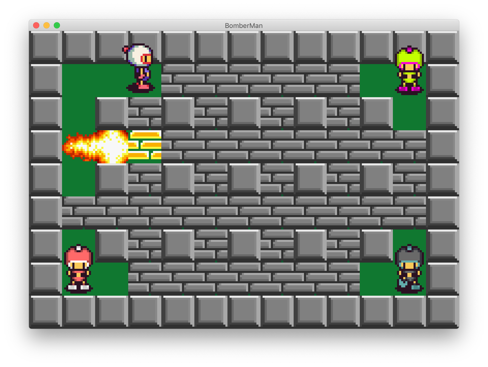

# Como executar
- Instale o [JDK](https://www.oracle.com/technetwork/java/javase/downloads) do Java na sua máquina, se ainda não tiver.
- Rode os comandos:
   - `cd src`
   - Compile: `javac *.java`
   - Inicie o servidor: `java Server`
   - Inicie o cliente: `java Client`

# Introdução

Lançado pela desenvolvedora Hudson Soft em 1983, o clássico Bomberman foi um dos jogos mais conhecidos da história. Trata-se de um jogo de estratégia onde vence aquele que explodir o adversário, desde que não tenha se matado antes. Para isso é preciso destruir as paredes não-fixas com bombas explosivas para abrir caminho e, também, contar com a sorte para tentar encontrar, de forma aleatória, itens que dão um upgrade no personagem, como uma melhora do alcance da bomba ou um aumento da quantidade máxima de bombas simultâneas.

# Objetivo

Desenvolver programas em Java para que no mínimo duas pessoas, possivelmente localizadas remotamente, possam jogar interagindo através do teclado em um mapa 2D exibido para o usuário através de uma interface gráfica.

# Descrição
O jogo apresenta uma arquitetura cliente-servidor onde dois ou quatro jogadores remotos, interagindo com programas clientes idênticos, disputam através de um programa servidor também remoto. Estes programas serão desenvolvidos utilizando a linguagem Java, e Swing para o desenvolvimento da interface.
Através de um mapa exibido por uma interface gráfica, o jogador fará seus movimentos com as teclas W,A,S,D para movimentar o seu personagem para cima, esquerda, baixo ou direita, e ao apertar o ESPAÇO a bomba será plantada na posição atual. O servidor, responsável por intermediar os programas clientes, fica esperando as jogadas realizadas pelos clientes. Quando uma jogada é recebida, o servidor fará a consistência da jogada, atualizará uma representação interna do jogo e devolverá a todos os clientes o estado atual do mapa. Se, por outro lado, for tentada em uma jogada inválida, o servidor ignorará a jogada.

------

Autor: [Bruno Papa](https://github.com/brnpapa)

Sprites ripped by Zanaku, Game tilesets ripped by Plasma Captain.
